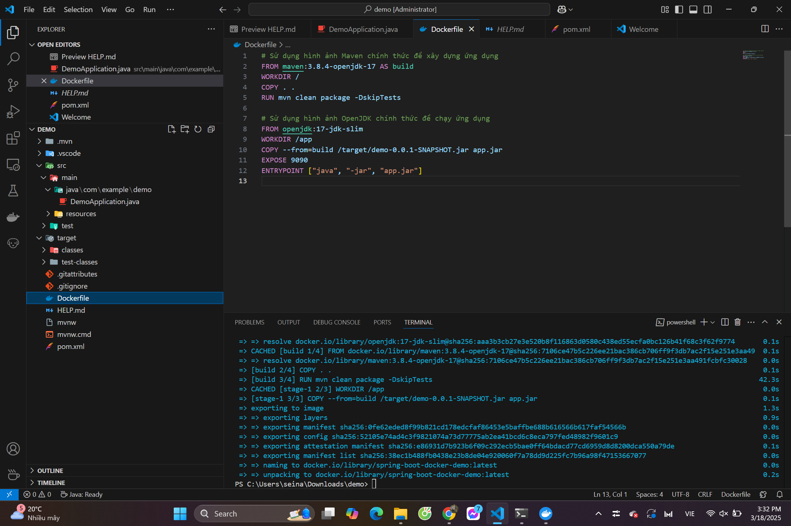
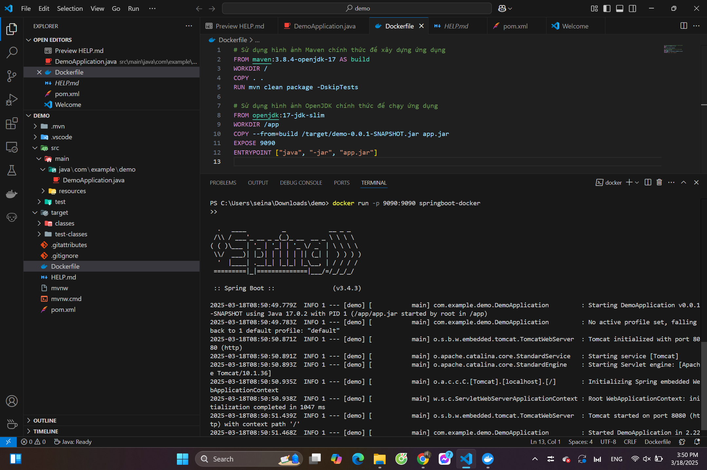
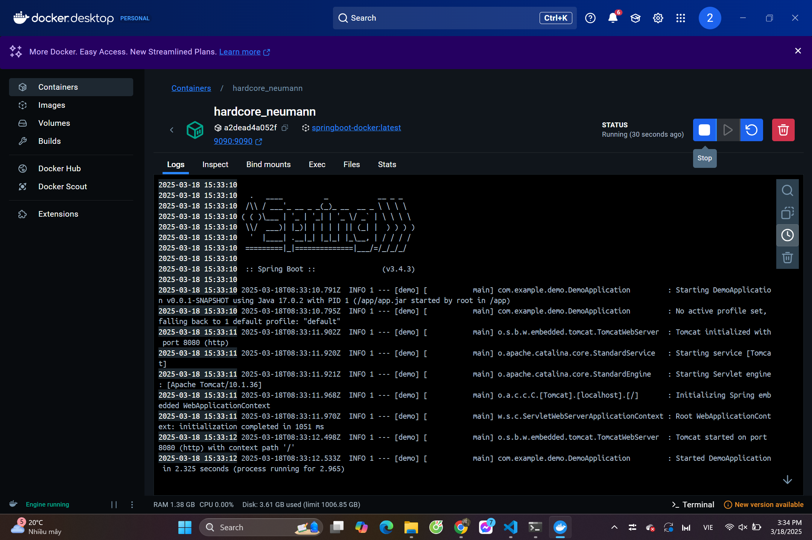
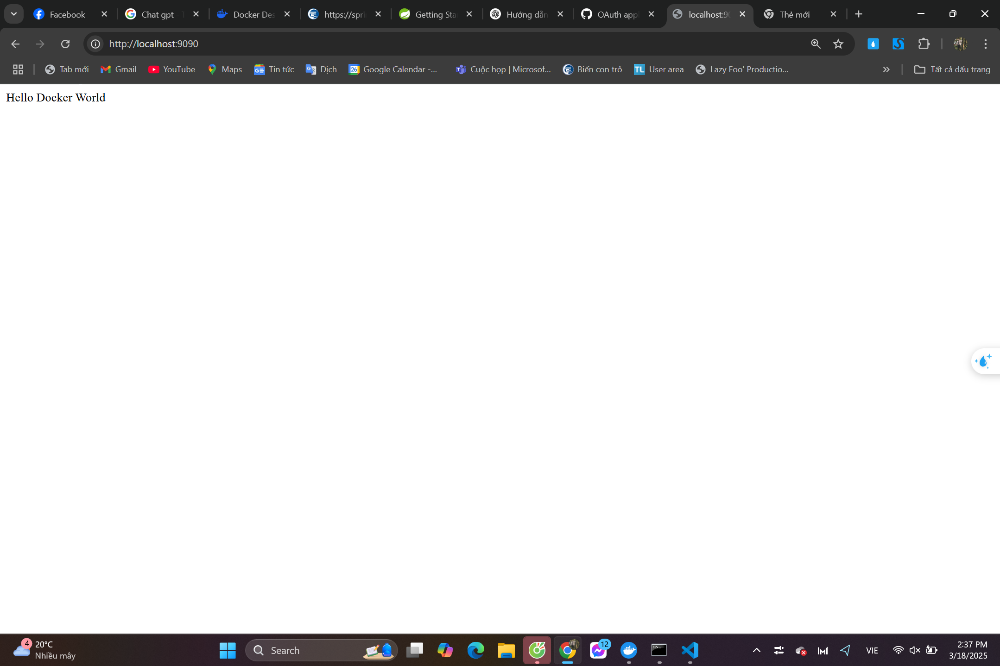

# Spring Boot - Docker

## Hướng dẫn chạy project

### **1. Cài đặt môi trường**
- Java 17
- Gradle 7.5+ hoặc Maven 3.5+
- Docker Destop
- **VS Code hoặc IntelliJ IDEA** (Để chỉnh sửa code nếu cần)

## **Các bước chạy thử**
Dưới đây là các bước minh chứng rằng hệ thống hoạt động đúng:

### **Bước 1: Build SpringBoot - Docker**
- Mở Terminal nhập lệnh: `docker build -t spring-boot-docker-demo .
`

> Hình ảnh trên cho thấy SpringBoot - Docker đã được build thành công

### **Bước 2: Chạy với cổng 9090 **
- Nhập tiếp lệnh:  `docker run -p 9090:9090 springboot-docker
`

> Hình ảnh trên cho thấy đã ánh xạ cổng 9090 của container sang cổng 9090 trên máy host.

> Hình ảnh trên cho thấy Docker đã chạy thành công với port 9090

### **Bước 3: Truy cập bằng URL**
- Mở trình duyệt nhập URL:  `http://localhost:9090
`

> Hình ảnh trên cho thấy đã mở thành công URL

---

Bài làm của: Nguyễn Đăng Hải - MSV 22024532
