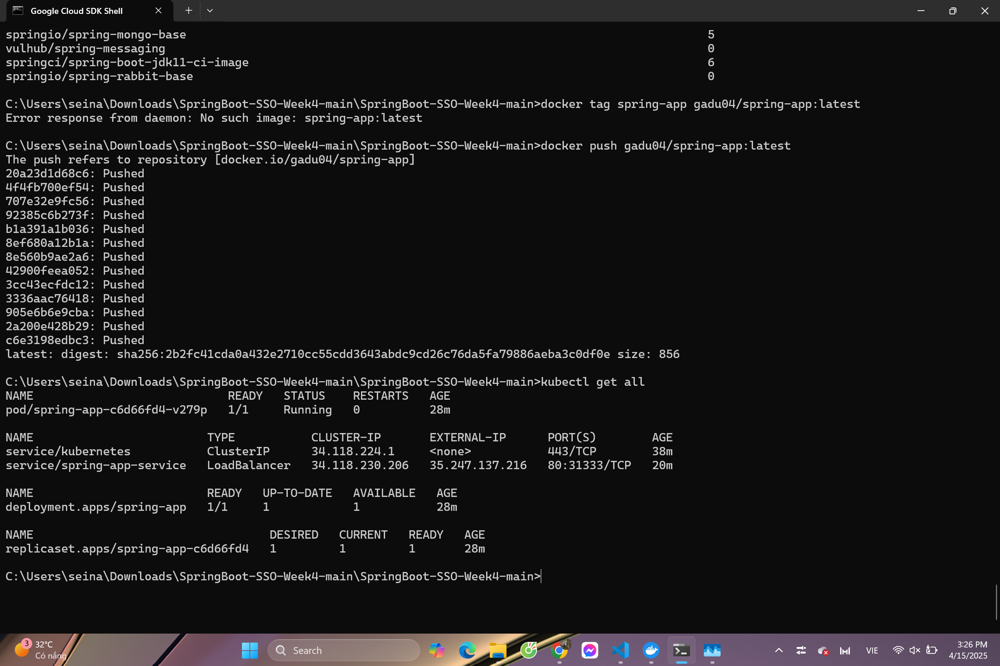
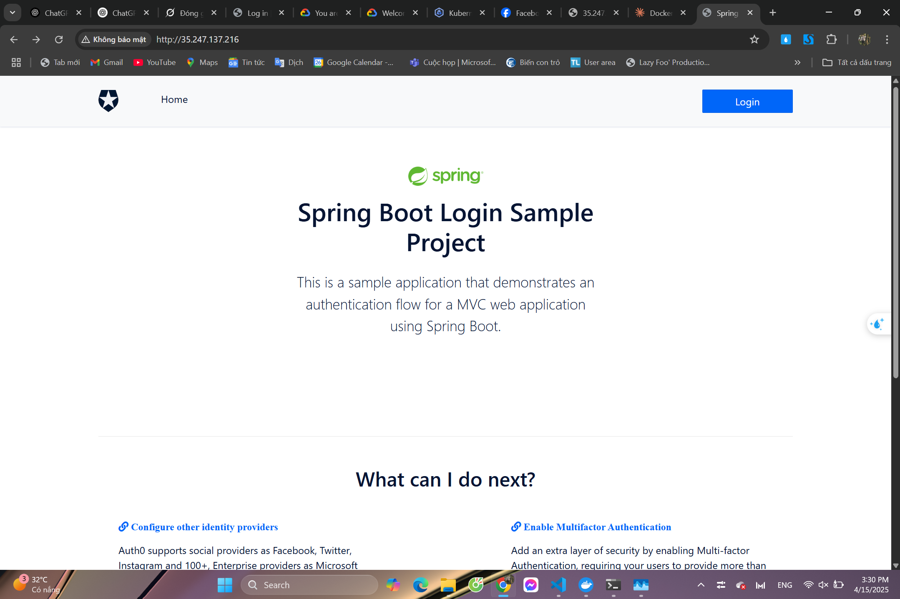
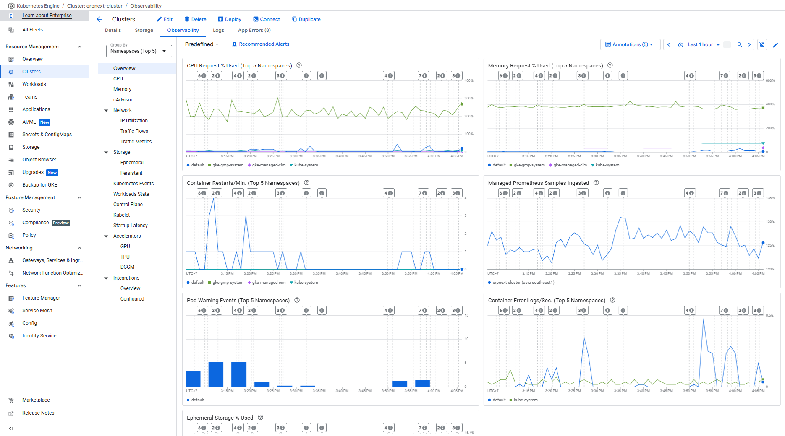
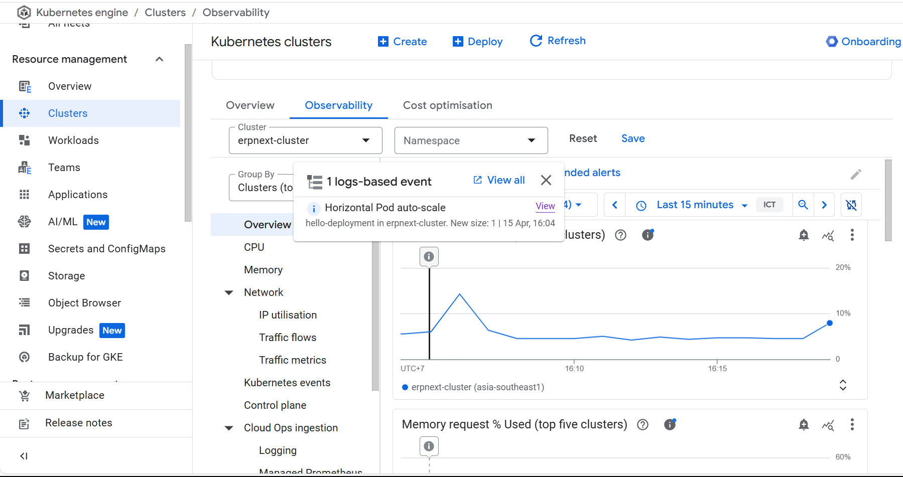

# 🌐 Spring Boot Login - Triển khai thủ công trên Google Kubernetes Engine (GKE) 

Ứng dụng Spring Boot tích hợp xác thực OAuth2, được đóng gói bằng Docker và triển khai thủ công lên GKE bằng `kubectl`.


---


## ✅ Tính năng chính 

 
- Xác thực OAuth2 với Auth0
 
- Container hóa bằng Docker
 
- Triển khai thủ công lên Google Kubernetes Engine
 
- Cấu hình LoadBalancer để truy cập công khai


---


## 🧰 Yêu cầu 

 
- Java 17
 
- Docker
 
- Tài khoản Google Cloud (GCP)
 
- Đã cài đặt:

 
  - [gcloud]()
 
  - [kubectl]()

---

## 🐳 Docker Build và Push 


```bash
docker build -t gadu04/spring-app .
docker push gadu04/spring-app:latest
```


---


## ☁️ Tạo Cluster GKE 

 
2. Vào **Kubernetes Engine**  trong GCP Console → Tạo cluster
 
4. Kết nối cluster:


```bash
gcloud container clusters get-credentials <cluster-name> --zone <zone> --project <project-id>
```


---


## 🚀 Triển khai ứng dụng 


### 1. Tạo Deployment 

`deployment.yaml`** 


```yaml
apiVersion: apps/v1
kind: Deployment
metadata:
  name: spring-app
spec:
  replicas: 1
  selector:
    matchLabels:
      app: spring-app
  template:
    metadata:
      labels:
        app: spring-app
    spec:
      containers:
      - name: spring-app
        image: docker.io/gadu04/spring-app:latest
        ports:
        - containerPort: 3000
---
apiVersion: v1
kind: Service
metadata:
  name: spring-app-service
spec:
  selector:
    app: spring-app
  ports:
  - port: 80
    targetPort: 3000
  type: LoadBalancer
```


### 2. Tạo Service 

`service.yaml`** 


```yaml
apiVersion: v1
kind: Service
metadata:
  name: spring-app-service
spec:
  selector:
    app: spring-app
  ports:
  - port: 80
    targetPort: 3000
  type: LoadBalancer
```


### 3. Deploy 


```bash
kubectl apply -f deployment.yaml
kubectl apply -f service.yaml
```


---


## 📸 Kiểm tra


### 1. Kiểm tra tài nguyên Kubernetes 


```bash
kubectl get all
```




---


### 2. Truy cập ứng dụng qua External IP 


```bash
kubectl get service my-spring-boot-service
```

Sau khi có địa chỉ `EXTERNAL-IP`, mở trình duyệt và truy cập:


```cpp
http://<EXTERNAL-IP>
```




---

### 3. Monitor trực tiếp trên Google Cloud Console


### 4. Thử nghiệm tăng tải với JMeter
- Thử với 5000 requests, hệ thống tự tăng thêm 1 cpu



## 👤 Tác giả 

**Nguyễn Đăng Hải**  – MSV 22024532