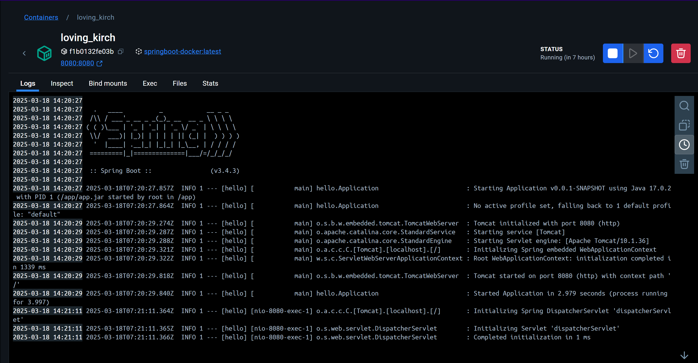
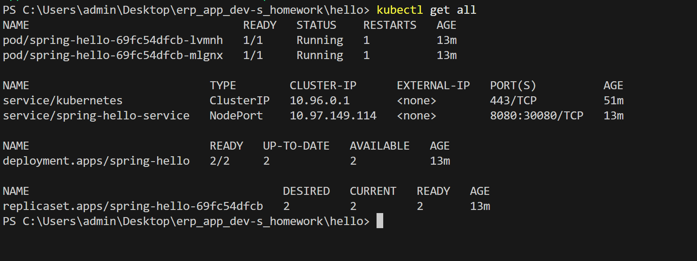

# Docker Desktop và Kubernetes

## Yêu cầu

- Java 17
- Docker Desktop
- Kubernetes (K8s) trên Docker Desktop

## Chạy ứng dụng với Docker Desktop và Kubernetes

### 1. Xây dựng image Docker

Mở terminal, di chuyển đến thư mục gốc của dự án và chạy lệnh sau:

docker build -t docker-example .

### 2. Đẩy image lên Docker Hub (tùy chọn)

docker tag docker-example your-dockerhub-username/docker-example
docker push your-dockerhub-username/docker-example

### 3. Chạy container Docker

docker run -p 8080:8080 docker-example

Ứng dụng sẽ khả dụng tại địa chỉ [http://localhost:8080](http://localhost:8080/).

Kết quả

### 4. Triển khai ứng dụng với Kubernetes

Tạo tệp deployment.yaml với nội dung sau:

apiVersion: apps/v1
kind: Deployment
metadata:
  name: docker-example
spec:
  replicas: 1
  selector:
    matchLabels:
      app: docker-example
  template:
    metadata:
      labels:
        app: docker-example
    spec:
      containers:
      - name: docker-example
        image: your-dockerhub-username/docker-example
        ports:
        - containerPort: 8080

Tạo tệp service.yaml để cấu hình service:

apiVersion: v1
kind: Service
metadata:
  name: my-spring-boot-service
spec:
  type: NodePort
  selector:
    app: docker-example
  ports:
  - protocol: TCP
    port: 80
    targetPort: 8080

### 5. Áp dụng cấu hình Kubernetes

kubectl apply -f deployment.yaml
kubectl apply -f service.yaml

### 6. Kiểm tra trạng thái Kubernetes

kubectl get all
Kết quả:

---

Bài làm của: Nguyễn Đăng Hải - MSV 22024532